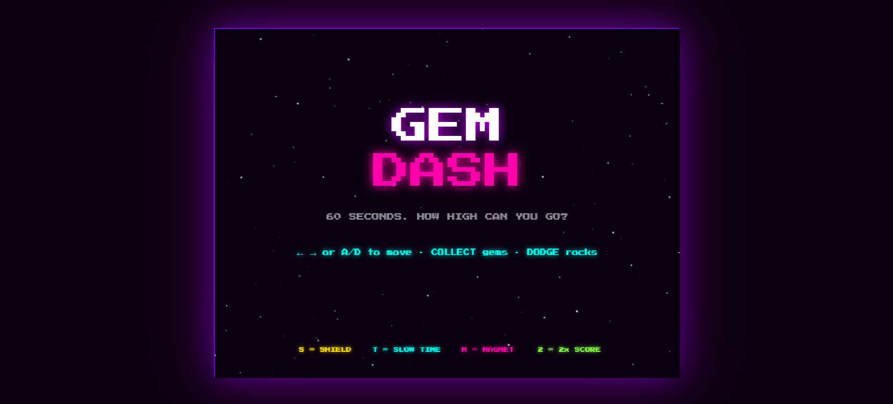
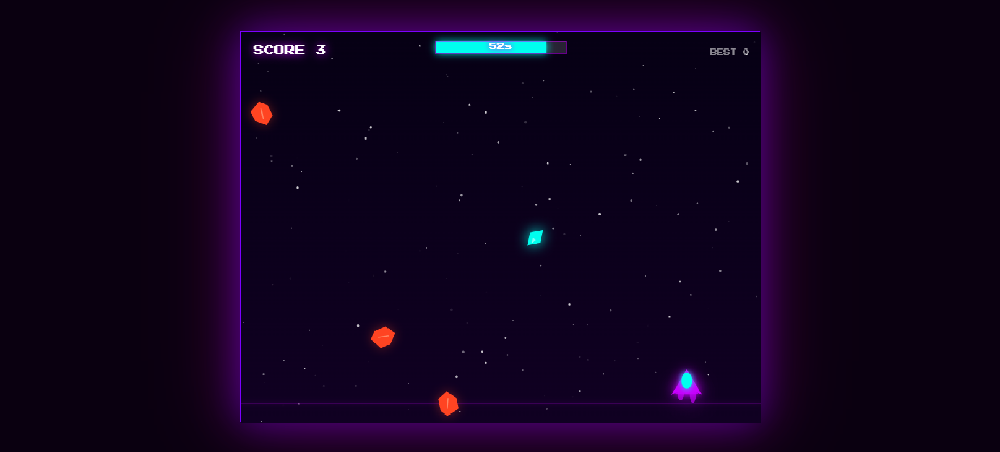
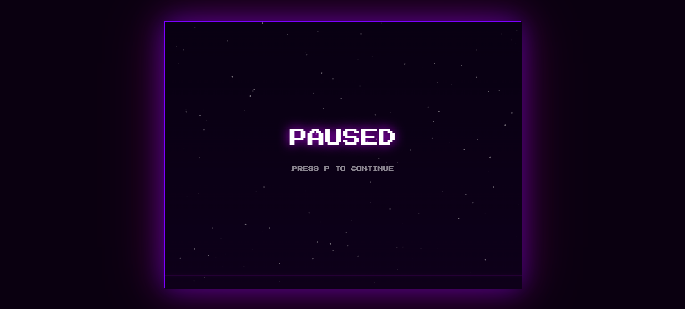
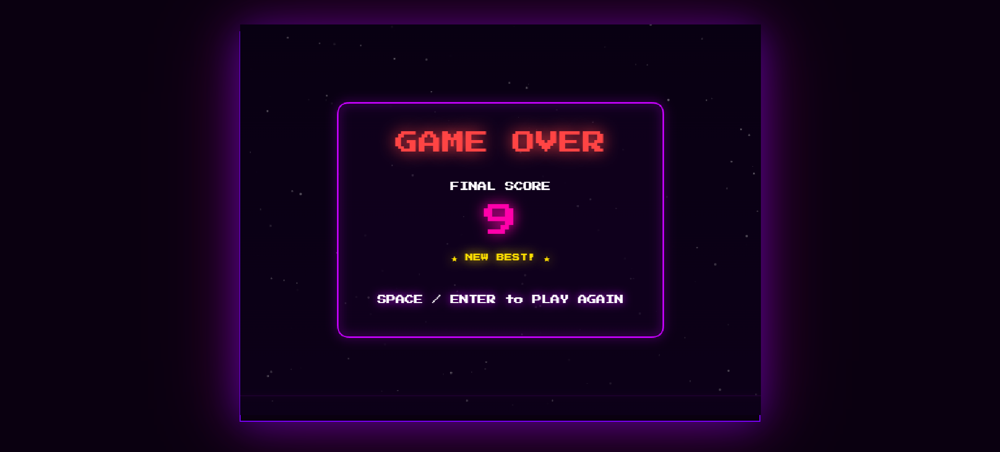

# 💎 GEM DASH

> A 60-second neon arcade game — collect gems, dodge rocks, chase your best score.


---

## 🎮 Play

**[▶ Play in your browser](https://mrdebugger.github.io/gem-dash/)**

Or just open `index.html` locally — no server, no build step, no dependencies.

---

## 📸 Screenshots
 
| Start Screen | Gameplay |
|---|---|
|  |  |
 
| Paused | Game Over |
|---|---|
|  |  |

---

## 🕹️ How to Play

| Action | Keys |
|---|---|
| Move left / right | `←` `→` or `A` `D` |
| Start / Restart | `Space` or `Enter` |
| Pause / Resume | `P` |
| Mobile | Tap to start, drag to move |

- **Gems (◆)** — collect for +1 point (more with combos & power-ups)
- **Rocks (▲)** — dodge them — one hit ends your run
- **Power-ups (★)** — grab them for a temporary edge

The game runs for **60 seconds**. When time's up your score is locked in. Hit a rock before then and it's over early.

---

## ✨ Features

### Core Mechanics
- 800 × 600 canvas, locked 60 fps via `requestAnimationFrame` + delta-time physics
- Difficulty ramps continuously over 60 s — spawn rate tightens from **1.4 s → 0.38 s**, fall speed climbs from **120 → 340 px/s**
- Persistent **high score** via `localStorage`

### Power-Ups
| Symbol | Name | Effect | Duration |
|---|---|---|---|
| **S** | Shield | Absorbs the next rock hit | 8 s |
| **T** | Slow Time | Reduces fall speed to 45% | 6 s |
| **M** | Magnet | Pulls nearby gems toward you | 7 s |
| **2** | Double Score | Multiplies gem points × 2 | 8 s |

### Game Feel (Juice)
- **Screen shake** on rock collision
- **Hit-stop** (~70 ms freeze) on collision
- **Particle bursts** on gem collect and rock hit
- **Score popups** floating off collected gems
- **Combo system** — consecutive gems without missing build a ×N multiplier (every 3 gems adds +1 to score per gem)
- **Player trail** and **object trails**
- **Engine flicker** on the ship with procedural glow
- **Parallax star field** scrolling in the background
- **Animated timer bar** that changes colour as time runs low

### Audio (Web Audio API — no files needed)
- 🎵 Gem collect — rising sine sweep
- 💥 Rock collision — sawtooth crunch
- 🎼 Game over — descending pitch slide
- ⭐ Power-up — ascending 4-note arpeggio
- 🔔 Combo ping — high sine blip at ×3+

### Accessibility / UX
- Tab-hidden auto-pause (`visibilitychange`)
- Touch support — drag finger to move ship
- No install, no build, no network required after first load

---

## 🗂️ Project Structure

```
gem-dash/
├── index.html      ← The entire game (HTML + CSS + JS, ~550 lines)
├── README.md
├── LICENSE
└── .gitignore
```

Everything lives in `index.html`. No bundler, no framework, no npm.

---

## 🛠️ Local Development

```bash
git clone https://github.com/yourusername/gem-dash.git
cd gem-dash
# Open in browser — any of:
open index.html                  # macOS
xdg-open index.html              # Linux
start index.html                 # Windows
python3 -m http.server 8080      # or serve with a local server
```

---

## 🚀 Deploy to GitHub Pages

1. Push this repo to GitHub
2. Go to **Settings → Pages**
3. Source: **Deploy from a branch** → `main` / `(root)`
4. Your game is live at `https://yourusername.github.io/gem-dash/`

---

## 🎨 Design Notes

**Palette** — Deep space purple `#0a0010` background, neon violet `#c800ff` primary, hot pink `#ff00aa` accent, electric cyan `#00ffee` for gems and UI highlights.

**Font** — [Press Start 2P](https://fonts.google.com/specimen/Press+Start+2P) (Google Fonts, loaded via CDN) for the full retro arcade look.

**Audio** — All sound effects are synthesized at runtime using the [Web Audio API](https://developer.mozilla.org/en-US/docs/Web/API/Web_Audio_API). No audio files to host.

**Sprites** — Fully procedural canvas drawing (no external images). The ship, gems, rocks, and power-ups are all drawn with `Path2D` / canvas 2D API calls.

---

## 🧩 Extending the Game

Want to hack on it? Some easy entry points:

- **Add a new power-up** — add an entry to `OBJ_CONFIGS`, handle it in the collision block, add a draw case in `drawPowerup()`
- **Change difficulty curve** — edit `spawnInterval()` and `fallSpeed()` in the script
- **New enemy type** — add a type that moves horizontally or bounces
- **Leaderboard** — swap `localStorage` for a simple backend POST

---

## 📜 License

[MIT](LICENSE) — do whatever you want with it.

---

## 🙏 Credits

Built with vanilla HTML5 Canvas + Web Audio API. No libraries harmed.

Font: [Press Start 2P](https://fonts.google.com/specimen/Press+Start+2P) by CodeMan38, via Google Fonts (OFL license).
